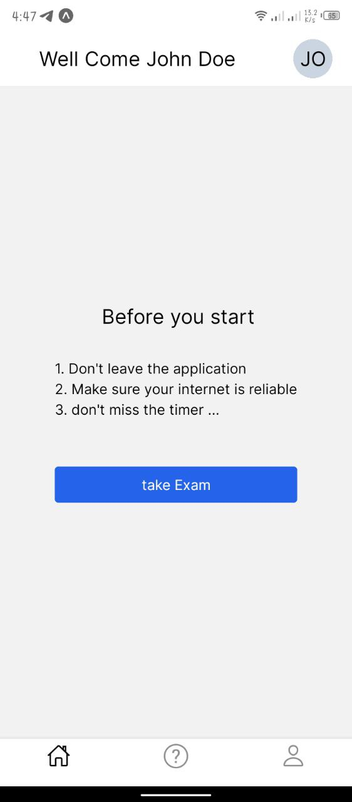
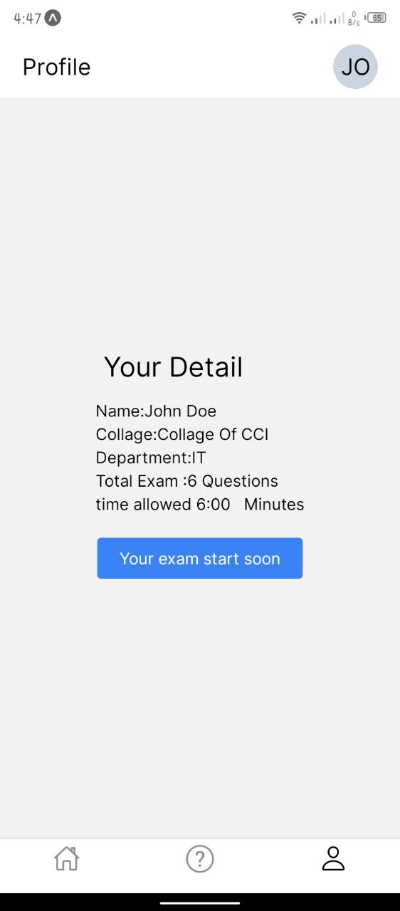
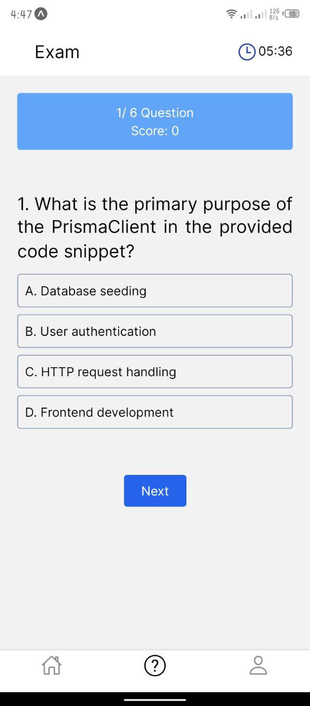
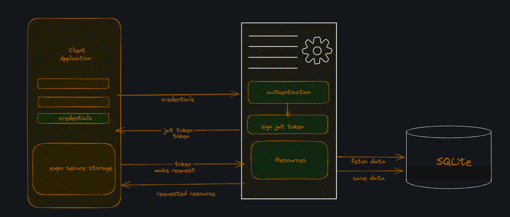
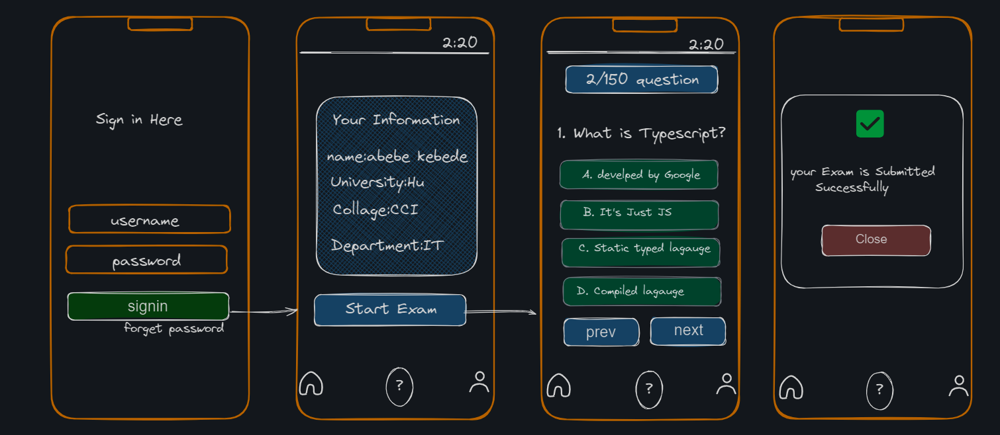

### Simple quiz application

**What we use to implement the project**

- **React-native**: mobile app framework
- **expo** React-native framework
- **Zustand**: state management
- **zod**: schema based validation library
- **react-hook-form**: React from validation library
- **Axios**: HTTP Client
- **Nativewind**: styling our application
- **expressJS**: for backend framework
- **Prisma**: ORM
- **SQLlite**: database:

**instruction**

- clone the repo
  ```sh
  git clone https://github.com/onesamket/exam-app.git
  ```
- navigate to your project folder
  ```sh
  cd exam-app
  ```
- install the dependency
  ```sh
  npm install
  ```

#### before start the application first

- navigate to the backend folder
  ```sh
  cd backend
  ```
- install dependency
  ```sh
  npm install
  ```
- setup the database
  ```sh
  npx prisma migrate dev --name test-migration
  ```
  👉 this command create our database and seed some dummy data.
- once your database sated up you're ready to start the server

  ```sh
  npm run dev
  ```

  👉 after running your server navigate back and run client application

- ```sh
  npx expo start
  ```

**Note:** Make sure you have Expo Go installed on your phone, or use an Android emulator or iOS simulator.
### example user 
- username:abebe 
- password:abe123
### Some screenshot Images





**NB:** question submit to the backend is not implemented yet.

**Simple client and server architecture of exam application**



#### Simple exam app user interact design phototype



**contact me**
[Gmail](https://onesamket@gmail.com)
[Github](https://github.com/onesamket)
